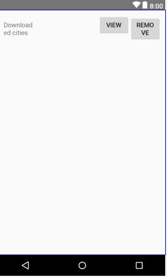
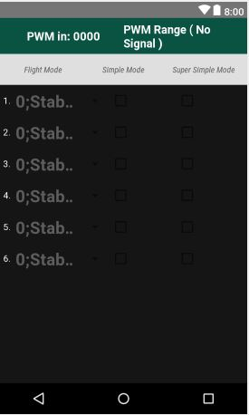
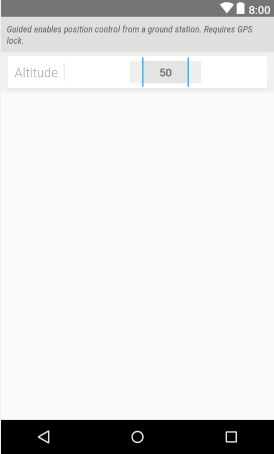
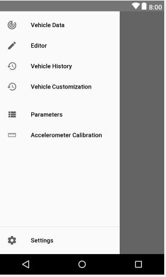
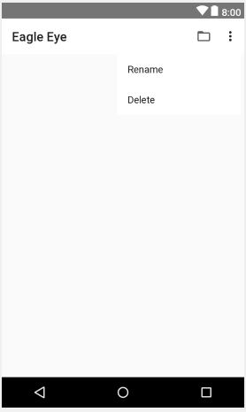
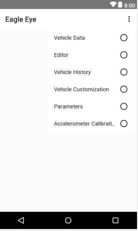
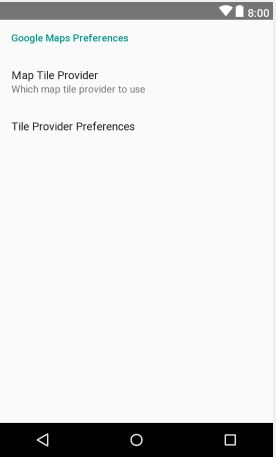

## Eagle-Eye for drone control
## need to add local.properties (sdk add)

    sdk.dir=E\:\\sdk
  
  
#### Documentaton

    https://docs.google.com/spreadsheets/d/1XE4mPwbqjAdYv4MbV5h7JHLQYnl-Bq8fkwkKajNmtVU/edit#gid=204397938    

#### Layout Screenshots
    
wp_enter_name.xml
 

 

widget_container_layout.xml
 

 

wheel_text_centered.xml
 

 

webview_drone_position.xml
 

 

vertical_fastscroller.xml
 

 

spinner_setup_item_dropdown.xml
 

 

spinner_setup_item.xml
 

 

spinner_setup.xml
 

 

spinner_param_value_item.xml
 

 

spinner_drop_down_mission_item.xml
 

 

spinner_drop_down_flight_mode.xml
 

 

spinner_configuration_screen_item.xml
 

 

show_wp_list.xml
 

 

row_params.xml
 

 

row_mission_list_old.xml
 

 

progress_bar.xml
 

 

preference_config_screen.xml
 

 

popup_info_signal.xml
 

 

popup_info_power.xml
 

 

popup_info_gps.xml
 

 

nav_header_main.xml
 

 

nav_header_droneshare.xml
 

 

manual_oparate_dialog.xml
 

 

list_widgets_list_pref_item.xml
 

 

list_value_item.xml
 

 

list_toggle_item.xml
 

 

list_switch_item.xml
 

 

list_select_item.xml
 

 

list_radio_item.xml
 

 

list_note_item.xml
 

 

list_level_item.xml
 

 

list_item_vehicle_info.xml
 

 

list_item_tlog_raw_event.xml
 

 

list_item_tlog_position_event.xml
 

 

list_item_tlog_data.xml
 

 

list_group_header.xml
 

 

list_check_item.xml
 

 

list_baidumap_offline_localmap_item.xml
 

 

layout_changelog_row_header.xml
 

 

layout_changelog_row.xml
 

 

item_selection.xml
 

 

horizontal_fastscroller.xml
 

 

fragment_widgets_list_pref.xml
 

 

fragment_widget_video_preferences.xml
 

 

fragment_widget_uvc_video.xml
 

 

fragment_widget_sololink_video.xml
 

 

fragment_vibration_viewer.xml
 

 

fragment_tlog_position_viewer.xml
 

 

fragment_tlog_data_picker.xml
 

 

fragment_setup_sf_main.xml
 

 

fragment_setup_rc_main.xml
 

 

fragment_setup_panel_summary.xml
 

 

fragment_setup_panel_start.xml
 

 

fragment_setup_panel_send.xml
 

 

fragment_setup_panel_progress.xml
 

 

fragment_setup_panel_next.xml
 

 

fragment_setup_modes.xml
 

 

fragment_setup_mag_main.xml
 

 

fragment_setup_imu_main.xml
 

 

fragment_setup_fm_main.xml
 

 

fragment_setup_compass.xml
 

 

fragment_setup_ch_main.xml
 

 

fragment_setup.xml
 

 

fragment_rover_mission_control.xml
 

 

fragment_rc.xml
 

 

fragment_plane_mission_control.xml
 

 

fragment_params.xml
 

 

fragment_parameters_info.xml
 

 

fragment_mode_stabilize.xml
 

 

fragment_mode_guided.xml
 

 

fragment_mode_follow.xml
 

 

fragment_mode_auto.xml
 

 

fragment_mini_widget_weather_info.xml
 

 

fragment_mini_widget_uvc_video.xml
 

 

fragment_mini_widget_solo_video.xml
 

 

fragment_mini_widget_geo_info.xml
 

 

fragment_mini_widget_flight_timer.xml
 

 

fragment_mini_widget_ekf_status.xml
 

 

fragment_mini_widget_attitude_speed_info.xml
 

 

fragment_locator_list_item.xml
 

 

fragment_graph_diagnostic_viewer.xml
 

 

fragment_gesture_map.xml
 

 

fragment_generic_mission_control.xml
 

 

fragment_flight_data.xml
 

 

fragment_ekf_flags_viewer.xml
 

 

fragment_editor_tools.xml
 

 

fragment_editor_list_item.xml
 

 

fragment_editor_list.xml
 

 

fragment_editor_detail_waypoint.xml
 

 

fragment_editor_detail_takeoff.xml
 

 

fragment_editor_detail_survey.xml
 

 

fragment_editor_detail_structure_scanner.xml
 

 

fragment_editor_detail_spline_waypoint.xml
 

 

fragment_editor_detail_set_servo.xml
 

 

fragment_editor_detail_rtl.xml
 

 

fragment_editor_detail_roi.xml
 

 

fragment_editor_detail_reset_roi.xml
 

 

fragment_editor_detail_loitert.xml
 

 

fragment_editor_detail_land.xml
 

 

fragment_editor_detail_generic.xml
 

 

fragment_editor_detail_epm_grabber.xml
 

 

fragment_editor_detail_do_jump.xml
 

 

fragment_editor_detail_condition_yaw.xml
 

 

fragment_editor_detail_circle.xml
 

 

fragment_editor_detail_change_speed.xml
 

 

fragment_editor_detail_camera_trigger.xml
 

 

fragment_droneshare_login.xml
 

 

fragment_droneshare_account.xml
 

 

fragment_copter_mission_contrrol.xml
 

 

fragment_baidumap_offline_map_preference.xml
 

 

fragment_attitude_indicator.xml
 

 

fragment_action_bar_telem.xml
 

 

dialog_yes_no_content.xml
 

 

dialog_uvc_device.xml
 

 

dialog_slide_to_unlock.xml
 

 

demo_changelog_fragment_dialogmaterial.xml
 

 

custom_schedule_rec_view.xml
 

 

custom_schedule_list.xml
 

 

control_dialog_view.xml
 

 

control_dialog.xml
 

 

card_wheel_horizontal_view_title.xml
 

 

card_wheel_horizontal_view.xml
 

 

button_my_location.xml
 

 

bonuspack_bubble_black.xml
 

 

bonuspack_bubble.xml
 

 

alertwpname.xml
 

 

adapter_nav_drawer_child.xml
 

 

activity_widget.xml
 

 

activity_tlog.xml
 

 

activity_editor.xml
 

 

activity_drawer_navigation_ui.xml
 

 

activity_download_mapbox_map.xml
 

 

activity_bluetooth_device_list.xml
 

 

menu_droneshare_account.xml
 

 

menu_flight_map.xml
 

 

menu_fragment_solo_mag_calibration.xml
 

 

menu_google_map.xml
 

 

menu_locator.xml
 

 

menu_mission.xml
 

 

menu_parameters.xml
 

 

menu_super_activity.xml
 

 

menu_tlog_position_viewer.xml
 

 

navigation_drawer_items.xml
 

 

navigation_drawer_settings.xml
 

 

preferences_google_maps.xml
 

 

preferences.xml
 

 

preferences_connection.xml
 

 

